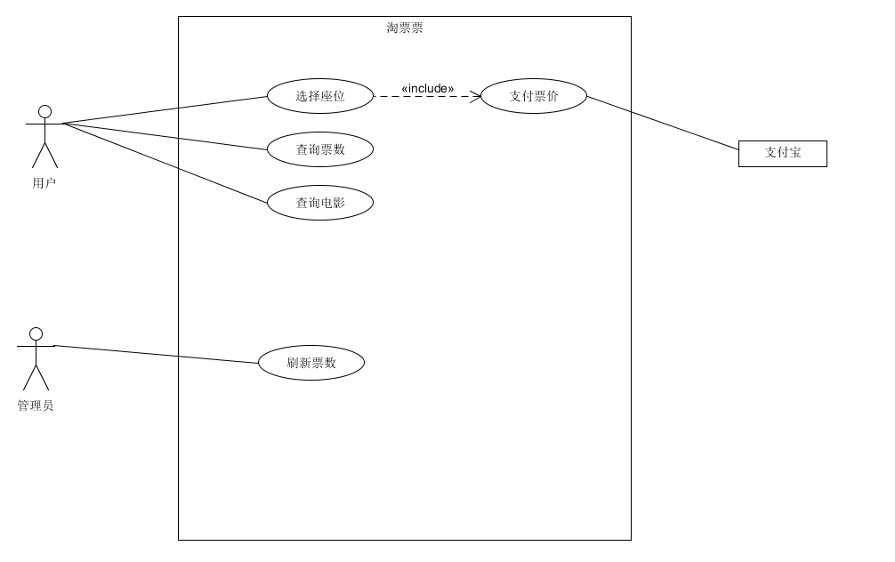
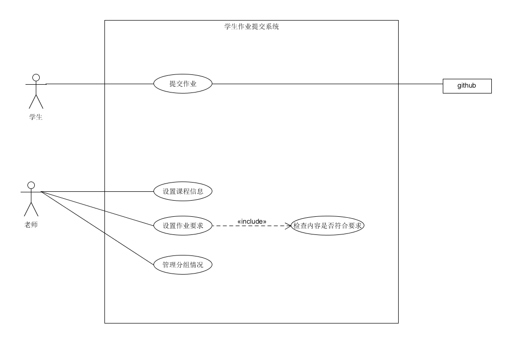

## 1、简答题  
### 1、用例的概念  
用例是文本形式的情节描述，用以说明某参与者使用系统以实现某些目标。  
用例是文本文档，而非图形。  
### 2、用例和场景的关系？什么是主场景或happy path？  
用例就是一组相关的成功和失败场景集合；  
每个用例中必须描述一个主场景；  
Happy path在测试用例中指没有出现预期之外结果的场景，在用例建模中指主成功场景中，主执行者完成了目标，所有相关人员的需求都被满足了。
### 3、用例有哪些形式？  
摘要、非正式、详述。
### 4、对于复杂业务，为什么编制完整用例非常难？  
因为复杂的业务涉及的场景较多。
### 5、什么是用例图？  
用例图是描述用例名称和参与者及其之间的关系的表示法。
### 6、用例图的基本符号与元素？  
人表示参与者、系统边界表示研究的系统、边界内的椭圆表示用例、边界右侧的方框表示支持性参与者（第三方）、连线表示两者之间的关系。
### 7、用例图的画法与步骤  
确定参与者、计算机系统参与者和用例，主要参与者置于左侧，支持性参与者置于右侧，用例置于中间边界内。确定用例关系并用连线进行连接。
### 8、用例图给利益相关人与开发者的价值有哪些？  
用例图能够展示系统边界、位于边界之外的食物以及系统如何被使用。用例图可以作为沟通的工具，用以概括系统及其参与者的行为。
## 2、建模练习题（用例模型）  
#### 选择2-3个你熟悉的类似业务的在线服务系统（或移动 APP），如定旅馆（携程、去哪儿等）、定电影票、背单词APP等，分别绘制它们用例图。并满足以下要求：   
    * 请使用用户的视角，描述用户目标或系统提供的服务
    * 粒度达到子用例级别，并用 include 和 exclude 关联它们
    * 请用色彩标注出你认为创新（区别于竞争对手的）用例或子用例
    * 尽可能识别外部系统和服务
#### 然后，回答下列问题： 
    * 为什么相似系统的用例图是相似的？
    * 如果是定旅馆业务，请对比 Asg_RH 用例图，简述如何利用不同时代、不同地区产品的用例图，展现、突出创新业务和技术
    * 如何利用用例图定位创新思路（业务创新、或技术创新、或商业模式创新）在系统中的作用
    * 请使用 SCRUM 方法，选择一个用例图，编制某定旅馆开发的需求（backlog）开发计划表
    * 根据任务4，参考 使用用例点估算软件成本，给出项目用例点的估算
在此分析了淘票票电影票查询系统和学生作业提交系统：  
  
  
